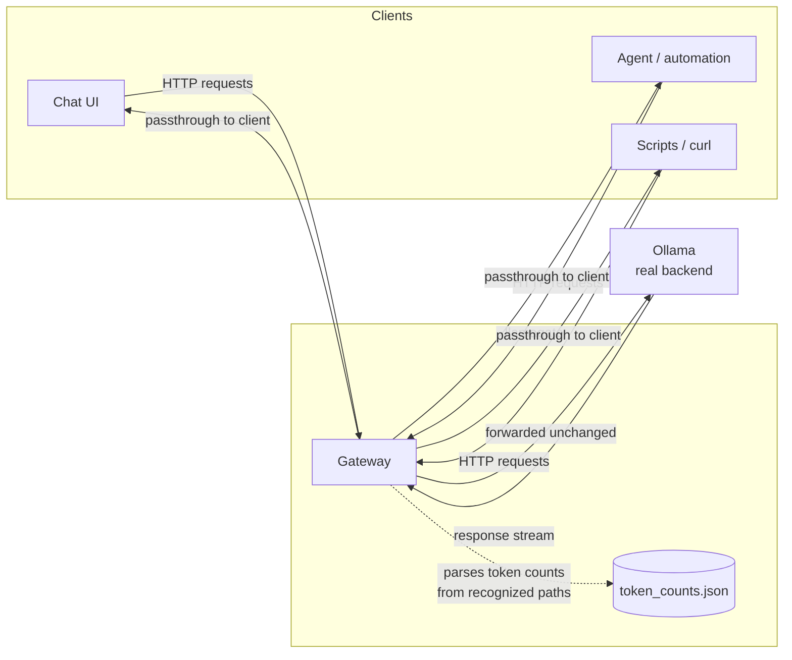

# llamagate

A transparent gateway that sits in front of [Ollama](https://ollama.com).

It forwards every request byte-for-byte unchanged, so it's a drop-in
replacement for Ollama's own address — point any existing client at
llamagate instead of Ollama directly, and it keeps working exactly as
before. Llamagate observes traffic in transit to add capabilities Ollama
doesn't have natively.

**Today:** token usage counting (today + all-time), persisted to disk and
safe under concurrent requests.

**Roadmap:** llamagate is built as the foundation for an observability and
security layer in front of Ollama — request logging, per-client usage
breakdowns, rate limiting, and access control are natural next steps, all
without requiring clients to change how they connect.

## Why a gateway instead of modifying Ollama itself?

Ollama has no built-in cumulative token counter, request log, or access
control across requests. Rather than patching Ollama or asking every client
to implement this themselves, a gateway is the single place that sees *all*
traffic regardless of which client sent it — chat UIs, autonomous agents,
curl scripts, anything — and the natural place to enforce policy later.

## Architecture



**Key design point:** llamagate inspects response streams for two known
formats in order to count tokens, but always forwards the *original* bytes
downstream unchanged — clients never see anything different from talking to
Ollama directly.

| Path pattern | Format | How tokens are counted |
|---|---|---|
| `/api/generate`, `/api/chat` | Ollama native NDJSON | Final chunk (`done: true`) includes `eval_count` + `prompt_eval_count` |
| `/v1/chat/completions`, `/v1/completions` | OpenAI-compatible SSE | `usage` field, when present, in a `data: {...}` chunk |
| Everything else | N/A | Passed through untouched, uncounted |

### Where this is headed

```mermaid
flowchart TB
    subgraph "llamagate today"
        direction LR
        d1[Reverse proxy] --> d2[Token counting]
    end

    subgraph "llamagate roadmap"
        direction LR
        r1[Request logging] --- r2[Per-client usage] --- r3[Rate limiting] --- r4[Access control]
    end

    "llamagate today" -.->|same request path,<br/>same client config| "llamagate roadmap"
```

Every future feature hooks into the same place: the point where llamagate
already inspects (or passes through) response bytes for each request. See
"Adding a new feature" below.

## Requirements

- Python 3.10+
- A running Ollama instance
- `pip install -r requirements.txt`

## Configuration

All configuration is via environment variables — no config file to edit.

| Variable | Default | Description |
|---|---|---|
| `OLLAMA_UPSTREAM_URL` | `http://127.0.0.1:11434` | Where the real Ollama instance is listening |
| `PROXY_HOST` | `127.0.0.1` | Address llamagate binds to (dev server only — see Production below) |
| `PROXY_PORT` | `11434` | Port llamagate listens on |
| `LLAMAGATE_COUNTS_FILE` | `<project dir>/token_counts.json` | Where token counts are persisted |
| `LLAMAGATE_UPSTREAM_TIMEOUT` | `300` | Seconds to wait on a single upstream request |

## Quick start (development)

```bash
pip install -r requirements.txt
python3 llamagate.py
```

By default this proxies to Ollama on its normal port (`11434`) and also
tries to bind llamagate itself to `11434` — **you need to move real Ollama
to a different port first**, since they can't both use the same one. See
"Typical deployment" below.

## Typical deployment

The common setup: move Ollama to an internal-only port, and let llamagate
occupy Ollama's original, well-known port. This way every existing client
already pointed at "Ollama's address" gets gatewayed — and counted — with
zero reconfiguration on the client side.

```bash
# 1. Move Ollama off its default port (example: systemd override)
sudo systemctl edit ollama
# Add:
#   Environment="OLLAMA_HOST=127.0.0.1:11436"
sudo systemctl restart ollama

# 2. Point llamagate at Ollama's new location, and have it take over
#    Ollama's old port
export OLLAMA_UPSTREAM_URL=http://127.0.0.1:11436
export PROXY_PORT=11434
python3 llamagate.py
```

Every client that was previously configured to reach Ollama at
`127.0.0.1:11434` keeps working unchanged, now transparently gatewayed.

## Production (gunicorn + systemd)

The built-in Flask dev server is unsuitable for anything but local testing.
Use gunicorn instead.

```bash
pip install gunicorn
python3 -m gunicorn --workers 1 --threads 8 --bind 127.0.0.1:11434 --timeout 300 llamagate:app
```

**Important: always use `--workers 1`.** Token counting uses an in-process
lock to protect the counts file from concurrent writes. Multiple *worker
processes* each have their own independent lock and would race against each
other, corrupting the counts file. Use `--threads` to raise concurrency
instead — threads within a single process safely share the same lock.

A ready-to-adapt systemd unit is provided at
[`systemd/llamagate.service.example`](systemd/llamagate.service.example).
Copy it, fill in the placeholders (`CHANGE_ME` user, real paths), and:

```bash
sudo cp systemd/llamagate.service.example /etc/systemd/system/llamagate.service
# edit the copied file with your actual user/paths
sudo systemctl daemon-reload
sudo systemctl enable --now llamagate
```

## Endpoints added by llamagate itself

These are served directly by llamagate, not forwarded to Ollama:

- `GET /proxy/health` → `{"ok": true, "upstream": "<configured upstream URL>"}`
- `GET /proxy/stats` → `{"tokens_today": <int>, "tokens_total": <int>}`

Any other path is forwarded to Ollama as-is.

## Known limitations

- Token counting only works for the path patterns listed above. A client
  using a different endpoint (e.g. `/api/embeddings`) is forwarded correctly
  but not counted.
- SSE usage data (`/v1/...` paths) is only present if the upstream/client
  combination actually includes a `usage` field in the stream — not every
  client requests this, and not every backend includes it by default. If
  `tokens_today` doesn't move for `/v1/...` traffic, this is the most
  likely reason, not a bug in llamagate.
- The counts file is a single JSON file with a lock, which is fine for
  personal/small-team usage. It's not designed for high-throughput
  multi-tenant scenarios — that would need a real database, which is a
  natural evolution as the observability/security roadmap above develops.
- No authentication or access control yet — that's explicitly on the
  roadmap, not a current feature.

## Adding a new feature

Llamagate is intentionally simple today: one file, one clear request/
response path. To add a new capability (e.g. per-client usage breakdown,
request logging, rate limiting, access control):

1. Add your own state/persistence helpers near the token-counting ones.
2. Hook into the `generate()` closures inside `proxy()` — this is where
   response bytes are already being inspected (or passed through) for each
   path category.
3. Avoid changing what gets `yield`ed to the client — that must always stay
   byte-for-byte identical to what Ollama sent, or you'll break clients that
   depend on exact framing (especially SSE consumers).
4. For access-control-style features (the security half of the roadmap),
   the natural hook point is earlier — before the `requests.request(...)`
   call — to reject/modify a request before it ever reaches Ollama.

## License

MIT
